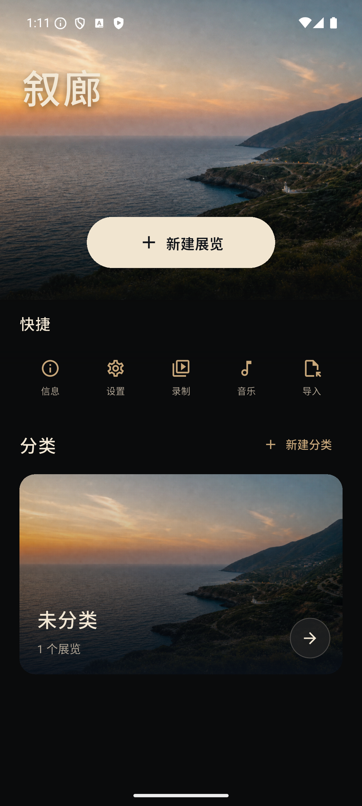

# 叙廊 · Xulang

<p align="center">
  
</p>

<p align="center">
  一款本地优先的照片叙事与微型展览创作应用。<br>
  A local-first photo storytelling and miniature exhibition creator.
</p>

<p align="center">
  <a href="https://github.com/Szj510/xulang/actions/workflows/ci.yml"></a>
  <a href="https://github.com/Szj510/xulang/releases/latest"></a>
  <a href="LICENSE"></a>
  
</p>

<p align="center">
  <a href="https://github.com/Szj510/xulang/releases/latest"><strong>下载最新版 / Download latest</strong></a>
  ·
  <a href="https://xulang.dpdns.org/">项目主页 / Website</a>
</p>

<p align="center">
  
  
  
</p>

<p align="center">图库 Library → 编辑 Editor → 沉浸播放 Immersive viewer</p>

[简体中文](#简体中文) · [English](#english)

## 简体中文

叙廊将照片组织成章节和叙事路径。你可以为每个章节选择画布、布局、画框、装饰、文字、背景音乐和播放节奏，再通过沉浸播放或 Android 录屏生成可分享的作品。

### 核心特性

- **本地优先**：无需账号或云同步，不申请网络权限；照片、模板、音乐和录屏保存在设备本地。
- **章节化叙事**：使用多章节、叙事路径、远近关系和播放节奏组织照片。
- **画框与题字**：包含经典、手绘和留白题字画框，题字与照片作为一个整体移动、旋转和保存。
- **自由文字装饰**：文字可在画布上独立移动、缩放、旋转和删除，支持系统字体与三款 OFL 中文展示字体。
- **沉浸播放**：支持横竖屏浏览、章节切换、自动播放和背景音乐。
- **模板与分享**：导入、导出不含照片的 `.xulang-template.json` 模板，并生成离线 HTML 展览。
- **Android 录屏**：用户主动授权后生成 MP4；录屏功能目前仅支持 Android。

### 下载与安装

官方构建只发布在 [GitHub Releases](https://github.com/Szj510/xulang/releases/latest)，支持 Android 10（API 29）或更高版本。

- 绝大多数手机请下载 `android-arm64-v8a.apk`，体积更小。
- 如果不确定设备架构，请下载 `android-universal.apk`。
- Android 可能要求允许浏览器或文件管理器“安装未知应用”。

下载后可用 Release 中的 `SHA256SUMS.txt` 校验文件。官方签名证书 SHA-256：

```text
0f3c0452bb00517e93ce6eaf2fe944106a062c71dfe6a077bac241d0e46f167d
```

安装 [GitHub CLI](https://cli.github.com/) 后还可验证构建来源：

```bash
gh attestation verify xulang-v1.4.0-android-arm64-v8a.apk --repo Szj510/xulang
```

### 从源码构建

需要 Flutter 3.41.7、Dart 3.11.5、JDK 17 和 Android SDK：

```bash
flutter pub get
dart format --output=none --set-exit-if-changed lib test
flutter analyze --no-pub
flutter test --no-pub --reporter compact
flutter build apk --debug
```

Release 构建需要维护者自己的 Android 签名配置；不要将 `key.properties`、keystore 或密码提交到仓库。

### 隐私、贡献与路线图

叙廊不申请网络权限，也不会上传照片、音乐、模板或视频。完整说明见[隐私政策](https://xulang.dpdns.org/privacy.html)。

欢迎 Bug 报告、功能建议和 Pull Request。请先阅读[贡献指南](CONTRIBUTING.md)与[行为准则](CODE_OF_CONDUCT.md)。安全问题不要创建公开 Issue，请按[安全政策](SECURITY.md)使用 GitHub 私密漏洞报告。

路线图：继续改善无障碍体验，扩展布局、画框和模板能力；欢迎社区参与 [iOS 版本的设计与实现](https://github.com/Szj510/xulang/issues/3)。项目会继续保持本地优先，不引入账号、云同步或远程素材市场。

## English

Xulang turns photos into chapters and narrative paths. Each chapter can use its own canvas, layout, frame, decorations, text, music, and playback timing, then become an immersive exhibition or an Android screen recording.

### Highlights

- **Local first:** no account, cloud sync, or network permission; photos, templates, music, and recordings stay on the device.
- **Chapter-based storytelling:** arrange photos with chapters, narrative tracks, depth, and playback timing.
- **Frames and inscriptions:** classic, hand-drawn, and caption-mat frames; the photo, paper, inscription, and rotation remain one object.
- **Free-text decorations:** move, resize, rotate, edit, and delete text directly on the canvas, using the system face or three bundled OFL Chinese display fonts.
- **Immersive viewing:** portrait and landscape navigation, chapter switching, autoplay, and background music.
- **Templates and sharing:** import or export photo-free `.xulang-template.json` templates and generate offline HTML exhibitions.
- **Android recording:** create MP4 recordings after explicit system consent; built-in recording is Android-only.

### Download

Official builds are available only from [GitHub Releases](https://github.com/Szj510/xulang/releases/latest) for Android 10 (API 29) or newer. Choose the smaller `android-arm64-v8a.apk` for most phones, or `android-universal.apk` if you are unsure. Verify `SHA256SUMS.txt`, the certificate fingerprint above, and optionally the GitHub artifact attestation before installing.

### Build, privacy, and contributing

Use Flutter 3.41.7, Dart 3.11.5, JDK 17, and the Android SDK. The build and verification commands are shown in the Chinese section above and in [CONTRIBUTING.md](CONTRIBUTING.md).

Xulang does not request network access or upload user media. Read the [privacy policy](https://xulang.dpdns.org/privacy.html), [security policy](SECURITY.md), [contribution guide](CONTRIBUTING.md), and [Code of Conduct](CODE_OF_CONDUCT.md). Vulnerabilities must use GitHub private vulnerability reporting rather than a public issue.

Android 10+ is the supported release platform. Community contributors are welcome to help [design and implement iOS support](https://github.com/Szj510/xulang/issues/3); no iOS binary is currently distributed.

## License

Copyright (C) 2026 ius.

Xulang is licensed under the [GNU General Public License v3.0](LICENSE). Bundled fonts and their licenses are listed in [THIRD_PARTY_NOTICES.md](THIRD_PARTY_NOTICES.md).
